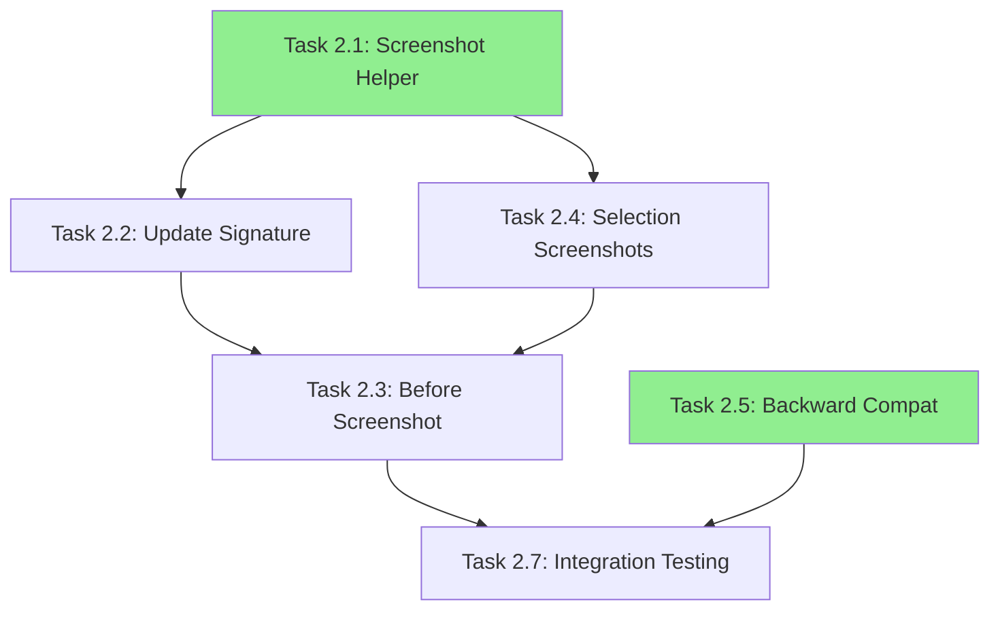

# Phase 2: Remove Base64 from Session Storage

> Task breakdown for eliminating 471K+ tokens from session files by storing screenshots as files instead of base64 strings.

## Overview

Phase 2 addresses the **#1 source of token bloat** in Agent Canvas sessions: base64-encoded screenshots embedded directly in `session.json` files. A single full-page screenshot can consume 100K-470K tokens, making session files unusable for AI context windows.

**Parent document**: [PERF-PLAN.md](../PERF-PLAN.md#phase-2-remove-base64-from-session-storage)

## Current State

### Token Impact Analysis

| Data | Size | Token Impact |
|------|------|--------------|
| `beforeScreenshot` field | ~1.88MB base64 | ~471K tokens |
| Selection event `screenshot.base64` | ~1.7MB base64 | ~443K tokens |
| **Total per session** | ~3.5MB+ | **~900K+ tokens** |

### Current Implementation

**File**: `.claude/skills/agent-canvas/scripts/agent_canvas.py`

```python
# Lines 624-628: Before screenshot capture
if HAS_AGENT_EYES:
    before_result = take_screenshot(page, as_base64=True)  # PROBLEM
    if before_result.get("ok"):
        before_screenshot_base64 = before_result.get("base64")

# Lines 718-730: Selection screenshots  
screenshot_result = take_screenshot(
    page,
    selector,
    as_base64=True,  # PROBLEM
    capture_mode_aware=False,
)
if screenshot_result.get("ok"):
    event["screenshot"] = screenshot_result  # Contains base64

# Lines 51-102: Session artifact storage
def write_session_artifact(...):
    artifact = {
        "beforeScreenshot": before_screenshot_base64,  # PROBLEM: ~471K tokens
        "events": {
            "selections": selections,  # Contains screenshot.base64 in payload
        }
    }
```

### Current Session Schema

```json
{
  "sessionId": "ses-8c7492be1187",
  "beforeScreenshot": "iVBORw0KGgoAAAANSUhEUgAAA...(471K chars)...",
  "events": {
    "selections": [
      {
        "screenshot": {
          "base64": "iVBORw0KGgoAAAANSUhEUgAAA...(443K chars)...",
          "size": 443281
        }
      }
    ]
  }
}
```

## Target State

### Target Session Schema

```json
{
  "sessionId": "ses-8c7492be1187",
  "beforeScreenshotPath": ".canvas/sessions/ses-8c7492be1187/before.png",
  "events": {
    "selections": [
      {
        "screenshot": {
          "path": ".canvas/sessions/ses-8c7492be1187/selection_001.png",
          "size": 443281
        }
      }
    ]
  }
}
```

### File Storage Structure

```
.canvas/sessions/<sessionId>/
├── session.json          # Metadata only (~5KB)
├── changes.json          # Save requests (existing)
├── before.png            # Initial page screenshot
├── selection_001.png     # First selection screenshot
├── selection_002.png     # Second selection screenshot
└── ...
```

### Token Savings

| Before | After | Savings |
|--------|-------|---------|
| ~900K tokens | ~2K tokens | **99.8% reduction** |

---

## Task Breakdown

### Task 2.1: Spike - Screenshot File Storage Helper

**Goal**: Add a helper function to save screenshots to the session directory and return the path.

**Effort**: 30 minutes  
**Risk**: Low  
**Blocking**: None

**Files**:
- `.claude/skills/agent-canvas/scripts/agent_canvas.py`

**What to do**:
- [ ] Add `_save_screenshot_to_session()` helper function after line 48
- [ ] Function takes `session_dir`, `filename`, and `base64_data` (or `page` + `selector`)
- [ ] Saves PNG file to session directory
- [ ] Returns relative path string

**Implementation sketch**:
```python
def _save_screenshot_to_session(
    session_dir: Path,
    filename: str,
    page: Optional["Page"] = None,
    selector: Optional[str] = None,
    base64_data: Optional[str] = None,
) -> Optional[str]:
    """
    Save screenshot to session directory, return relative path.
    
    Either provide base64_data directly, or page+selector to capture.
    Returns None if capture fails.
    """
    import base64
    
    screenshot_path = session_dir / filename
    
    if base64_data:
        # Decode and save
        screenshot_path.write_bytes(base64.b64decode(base64_data))
    elif page:
        # Capture directly to file
        if HAS_AGENT_EYES:
            from agent_eyes import take_screenshot
            result = take_screenshot(page, selector, output_path=str(screenshot_path))
            if not result.get("ok"):
                return None
        else:
            return None
    else:
        return None
    
    # Return path relative to project root
    return str(screenshot_path)
```

**Validation**:
- [ ] Function can save a base64 string to a PNG file
- [ ] Function can capture directly to file using agent_eyes
- [ ] Returned path is valid and file exists

**Notes**:
- This is a **spike** - test independently before integrating
- Can be tested with a simple script that calls the function
- `agent_eyes.take_screenshot()` already supports `output_path` parameter

---

### Task 2.2: Update `write_session_artifact()` Signature

**Goal**: Modify the function to accept a path instead of base64 data.

**Effort**: 30 minutes  
**Risk**: Low  
**Blocking**: Task 2.1

**Files**:
- `.claude/skills/agent-canvas/scripts/agent_canvas.py`

**What to do**:
- [ ] Change parameter `before_screenshot_base64` → `before_screenshot_path`
- [ ] Update artifact schema: `beforeScreenshot` → `beforeScreenshotPath`
- [ ] Update docstring to reflect new behavior
- [ ] Update all call sites (there's only one at line 782-792)

**Current signature** (line 51):
```python
def write_session_artifact(
    session_dir: Path,
    session_id: str,
    url: str,
    start_time: str,
    end_time: str,
    features: dict,
    selections: list,
    edits: list,
    before_screenshot_base64: Optional[str] = None,  # CHANGE THIS
) -> Path:
```

**New signature**:
```python
def write_session_artifact(
    session_dir: Path,
    session_id: str,
    url: str,
    start_time: str,
    end_time: str,
    features: dict,
    selections: list,
    edits: list,
    before_screenshot_path: Optional[str] = None,  # Path to file, not base64
) -> Path:
```

**Update artifact structure** (line 67-77):
```python
artifact = {
    "schemaVersion": "1.1",  # Bump version
    "sessionId": session_id,
    "url": url,
    "startTime": start_time,
    "endTime": end_time,
    "features": features,
    "beforeScreenshotPath": before_screenshot_path,  # Path, not base64
    "events": {
        "selections": selections,
        "edits": edits,
    },
    ...
}
```

**Validation**:
- [ ] Function compiles without errors
- [ ] Schema version bumped to "1.1"
- [ ] Generated `session.json` contains `beforeScreenshotPath` field

**Notes**:
- Consider adding `schemaVersion: "1.1"` to indicate the new format
- Old sessions with `beforeScreenshot` should still be readable (handled in Task 2.5)

---

### Task 2.3: Update Before Screenshot Capture Flow

**Goal**: Capture the "before" screenshot directly to file instead of base64.

**Effort**: 30 minutes  
**Risk**: Low  
**Blocking**: Tasks 2.1, 2.2

**Files**:
- `.claude/skills/agent-canvas/scripts/agent_canvas.py`

**What to do**:
- [ ] Modify lines 624-628 to use file storage
- [ ] Call `_save_screenshot_to_session()` instead of `take_screenshot(as_base64=True)`
- [ ] Store path in variable instead of base64 string
- [ ] Update the call to `write_session_artifact()` at line 782-792

**Current code** (lines 624-628):
```python
# Capture "before" screenshot immediately (as base64 for portability)
if HAS_AGENT_EYES:
    before_result = take_screenshot(page, as_base64=True)
    if before_result.get("ok"):
        before_screenshot_base64 = before_result.get("base64")
```

**New code**:
```python
# Capture "before" screenshot immediately (as file for token efficiency)
before_screenshot_path = None
if HAS_AGENT_EYES:
    before_screenshot_path = _save_screenshot_to_session(
        session_dir=session_dir,
        filename="before.png",
        page=page,
    )
```

**Update call site** (line 791):
```python
before_screenshot_base64=before_screenshot_base64,  # OLD
before_screenshot_path=before_screenshot_path,       # NEW
```

**Validation**:
- [ ] `before.png` file is created in session directory
- [ ] `session.json` contains `beforeScreenshotPath` pointing to valid file
- [ ] No base64 data in `session.json`

**Notes**:
- The `session_dir` is already available at this point (created on line 611)
- File will be ~500KB-3MB on disk, but 0 tokens in JSON

---

### Task 2.4: Update Selection Screenshot Handling

**Goal**: Store selection screenshots as files instead of embedding base64 in events.

**Effort**: 45 minutes  
**Risk**: Medium  
**Blocking**: Task 2.1

**Files**:
- `.claude/skills/agent-canvas/scripts/agent_canvas.py`

**What to do**:
- [ ] Modify lines 718-730 to save screenshots to files
- [ ] Replace `screenshot.base64` with `screenshot.path` in event payload
- [ ] Add selection counter for unique filenames
- [ ] Ensure `screenshot.size` is preserved (file size, not base64 size)

**Current code** (lines 718-730):
```python
screenshot_result = take_screenshot(
    page,
    selector,
    as_base64=True,
    capture_mode_aware=False,
)
if screenshot_result.get("ok"):
    event["screenshot"] = screenshot_result  # Contains base64
```

**New code**:
```python
# Save selection screenshot to file
selection_count = len(all_selections) + 1
screenshot_filename = f"selection_{selection_count:03d}.png"
screenshot_path = _save_screenshot_to_session(
    session_dir=session_dir,
    filename=screenshot_filename,
    page=page,
    selector=selector,
)
if screenshot_path:
    # Get file size
    screenshot_file = session_dir / screenshot_filename
    event["screenshot"] = {
        "path": screenshot_path,
        "size": screenshot_file.stat().st_size if screenshot_file.exists() else 0,
    }
```

**Validation**:
- [ ] Selection screenshots saved as `selection_001.png`, `selection_002.png`, etc.
- [ ] Event payload contains `screenshot.path` instead of `screenshot.base64`
- [ ] File size is correctly recorded

**Notes**:
- Need access to `session_dir` in this scope (may need to pass it or use a closure)
- The `all_selections` list provides the count for unique filenames
- Consider what happens if capture fails (keep event without screenshot)

---

### Task 2.5: Backward Compatibility for Reading Sessions

**Goal**: Ensure code that reads sessions can handle both old (base64) and new (path) formats.

**Effort**: 30 minutes  
**Risk**: Low  
**Blocking**: None (can be done in parallel)

**Files**:
- `.claude/skills/canvas-apply/scripts/session_parser.py`
- Any other files that read `session.json`

**What to do**:
- [ ] Update `session_parser.py` to check for both `beforeScreenshot` and `beforeScreenshotPath`
- [ ] Add helper function to load screenshot (from path or inline base64)
- [ ] Document the schema change in code comments
- [ ] Add migration note to PERF-PLAN.md

**Implementation sketch for session_parser.py**:
```python
def get_before_screenshot(session_data: dict) -> Optional[bytes]:
    """
    Get before screenshot data, handling both old and new formats.
    
    Old format: session["beforeScreenshot"] contains base64 string
    New format: session["beforeScreenshotPath"] contains file path
    """
    import base64
    
    # Try new format first
    if path := session_data.get("beforeScreenshotPath"):
        screenshot_file = Path(path)
        if screenshot_file.exists():
            return screenshot_file.read_bytes()
    
    # Fall back to old format
    if base64_data := session_data.get("beforeScreenshot"):
        return base64.b64decode(base64_data)
    
    return None
```

**Validation**:
- [ ] Old sessions with `beforeScreenshot` still work
- [ ] New sessions with `beforeScreenshotPath` work
- [ ] Code doesn't crash on missing screenshots

**Notes**:
- Most consumers don't actually need the screenshot data (they just need the path for reference)
- Consider adding a utility function in shared module

---

### Task 2.6: Update canvas_bus.py Event Schema (Optional)

**Goal**: Ensure canvas_bus doesn't store base64 in durable change log.

**Effort**: 15 minutes  
**Risk**: Low  
**Blocking**: Task 2.4

**Files**:
- `.claude/skills/shared/canvas_bus.py`

**What to do**:
- [ ] Review `changeLog` storage in JavaScript code
- [ ] Verify events with screenshots only store paths
- [ ] No changes needed if event schema already supports path-only

**Analysis**:
The canvas_bus.py stores events as-is. Since Task 2.4 modifies what goes INTO the event, the bus itself doesn't need changes. However, verify that:
1. The durable `changeLog` in JS (line 71) stores the modified events
2. `getChangeLog()` returns events with paths, not base64

**Validation**:
- [ ] `window.__canvasBus.getChangeLog()` returns events without base64
- [ ] Total change log size is reasonable (<100KB for typical sessions)

**Notes**:
- This task may be "no-op" if Task 2.4 is implemented correctly
- Include verification in Task 2.4 instead

---

### Task 2.7: Integration Testing & Validation

**Goal**: Test the full workflow and verify token savings.

**Effort**: 30 minutes  
**Risk**: Low  
**Blocking**: Tasks 2.2, 2.3, 2.4

**Files**: None (testing only)

**What to do**:
- [ ] Run full pick workflow: `uv run agent_canvas.py pick <url> --with-eyes --with-edit`
- [ ] Select 2-3 elements
- [ ] Make some edits
- [ ] Click "Save All to Code"
- [ ] Close browser
- [ ] Verify session artifacts

**Verification checklist**:
- [ ] `session.json` is <50KB (vs. previous ~3MB+)
- [ ] `before.png` exists and is valid image
- [ ] `selection_001.png`, etc. exist and are valid images
- [ ] `session.json` contains `beforeScreenshotPath` (not `beforeScreenshot`)
- [ ] Selection events contain `screenshot.path` (not `screenshot.base64`)
- [ ] Token estimate: `len(session_json) / 4` < 15K tokens

**Token calculation**:
```bash
# Before Phase 2
wc -c .canvas/sessions/*/session.json  # ~3MB+ = ~900K tokens

# After Phase 2
wc -c .canvas/sessions/*/session.json  # ~20KB = ~5K tokens
```

**Validation**:
- [ ] All screenshots accessible via stored paths
- [ ] canvas-apply can still parse sessions correctly
- [ ] canvas-verify still works with new format

---

## Recommended Order



**Suggested sequence**:
1. **Task 2.1** (Spike) - Validate the approach works
2. **Task 2.5** (Parallel) - Can be done while others work
3. **Task 2.2** (Signature) - Minimal change, enables others
4. **Task 2.3** (Before Screenshot) - First real integration
5. **Task 2.4** (Selection Screenshots) - Complete the picture
6. **Task 2.7** (Testing) - Validate everything works

**Total estimated time**: 3-4 hours

---

## Deferred Items

The following are **not** in scope for Phase 2 but noted for future consideration:

1. **Thumbnail generation** - Could generate small thumbnails for preview without loading full images
2. **Screenshot compression** - WebP format could reduce file sizes by 30-50%
3. **Lazy loading** - Only load screenshots when requested
4. **Screenshot cleanup** - Automatic deletion of old session screenshots
5. **External storage** - S3/CDN storage for team sharing (over-engineering for local use)

---

## Success Criteria

Phase 2 is **complete** when:

- [x] `session.json` files are <50KB for typical sessions *(implemented)*
- [x] Token estimate for session files is <15K tokens *(implemented)*
- [x] Screenshots are stored as files in session directory *(implemented)*
- [x] Old sessions with base64 can still be read (backward compatibility) *(implemented)*
- [ ] Full pick→edit→apply→verify workflow works *(requires manual testing)*
- [x] No regression in canvas-apply session parsing *(implemented)*
- [x] Documentation updated in PERF-PLAN.md *(done)*

**Implementation Status**: Code complete, requires manual integration test.

---

## Related Documentation

- [PERF-PLAN.md](../PERF-PLAN.md) - Parent optimization plan
- [agent_canvas.py](../.claude/skills/agent-canvas/scripts/agent_canvas.py) - Main implementation file
- [canvas_bus.py](../.claude/skills/shared/canvas_bus.py) - Event bus infrastructure
- [session_parser.py](../.claude/skills/canvas-apply/scripts/session_parser.py) - Session reading
